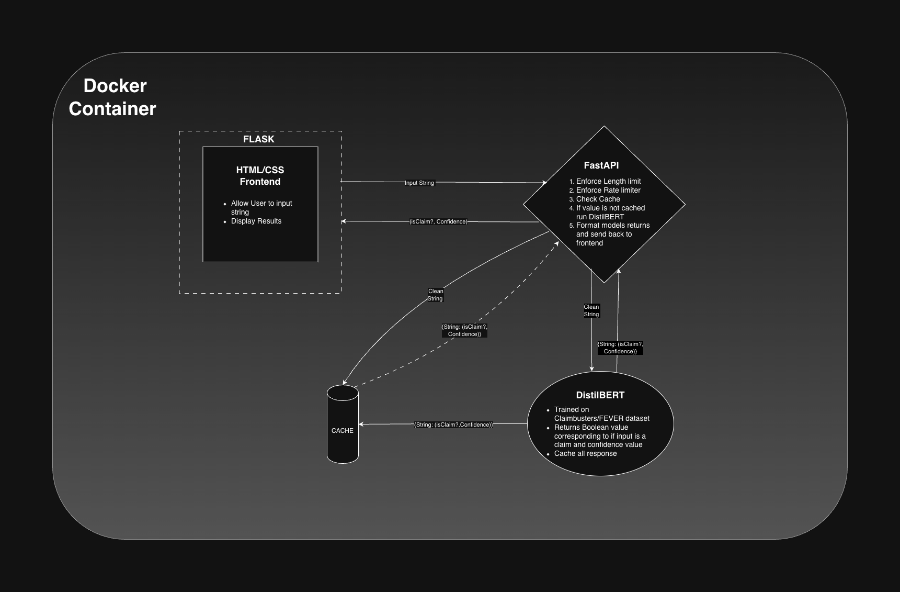
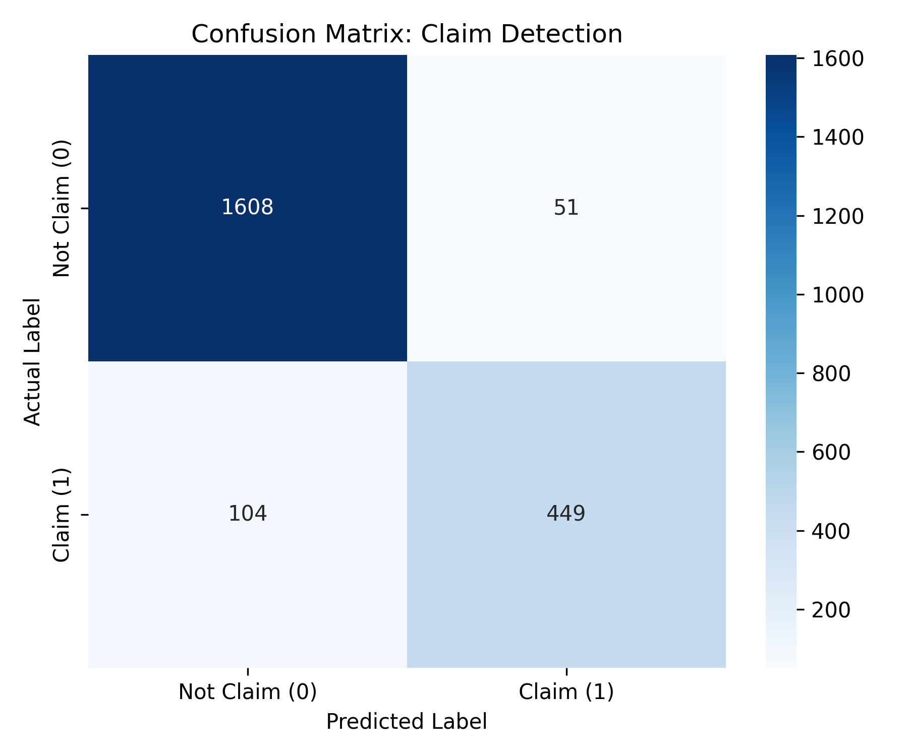
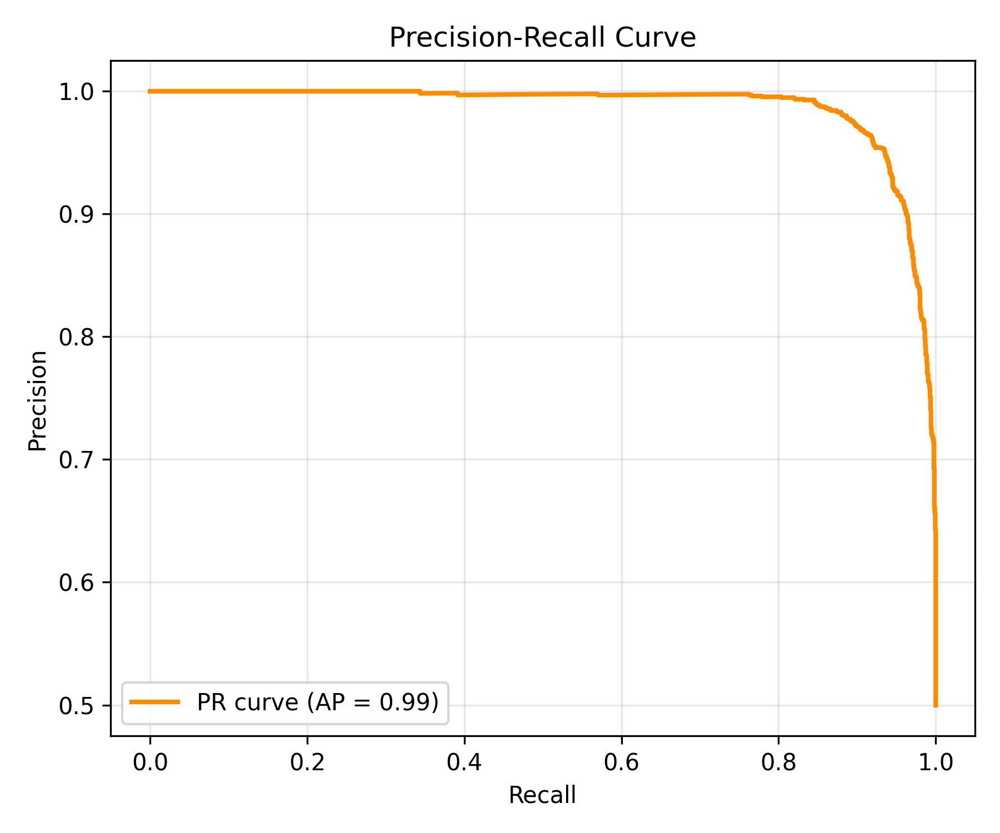
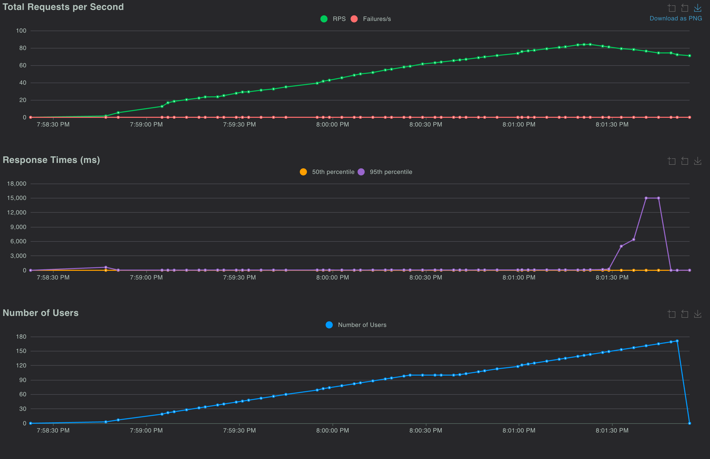

# Project Overview 
This project is a full-stack machine learning application designed to identify whether a given sentence contains a fact checkable claim or assertion. The system classifies natural language input and returns a boolean value along with a confidence score.

## Objectives
- *Fine-tuning*: Train a lightweight encoder model (DistilBERT) for binary classification.
- *API Development*: Build a high-performance FastAPI backend.
- *Production Readiness*: Implement caching, security validation, and Docker containerization.
- *Testing*: Conduct load testing via Locust to simulate production traffic.

# System Architecture 

## Breakdown 
- **Frontend**: 
    - *HTML/CSS/JS*: Static single-page app allowing users to input text and view classification results (True/False + Confidence %). Calls the API directly from the browser with `fetch()` — no server-side rendering, so it can be hosted on a static CDN.
- **API Gateway** (FastAPI): Handles incoming POST requests. It includes:
    - *Input Validation*: Input string is length validated to stop DoS via oversized payloads
    - *Rate Limiting*: Per-client-IP limits via SlowAPI, keyed off `CF-Connecting-IP` so it stays accurate behind the tunnel
    - *CORS*: Explicit origin allowlist, since the frontend is served from a different origin than the API
    - _LRU Cache_: An in-memory cache to store common phrases, bypassing model inference for repeated queries to save CPU cycles.
- **Inference Engine**: A fine-tuned DistilBERT model, exported to ONNX and served with ONNX Runtime. Training uses PyTorch; the deployed API does not depend on it at all. This is what makes the Pi deployment viable — the aarch64 torch wheels target Neoverse-class cores and crash with `SIGILL` on the Pi 5's Cortex-A76, while ONNX Runtime is 16MB, runs on baseline ARMv8, and benchmarks 3.4x faster on this model. See [deploy/README.md](deploy/README.md#why-onnx-runtime-and-not-pytorch).
- **Deployment**: Split hosting — the API and weights run on a Raspberry Pi behind a Cloudflare Tunnel; the static frontend is published to GitHub Pages. See **[deploy/README.md](deploy/README.md)**.

# Data Modeling and Trainer 
*Datasets: [ClaimBuster](https://zenodo.org/records/3836810) & [FeverClaims](https://fever.ai/dataset/fever.html)*

## Data Proccessing 
In order to ensure that we had a good mix of claims and non-claims along with a breadth of domains 2 datasets were combined. The ClaimBusters dataset was our main dataset but it was weighted towards non-factual statments so the FeverClaims dataset was brought in and proccessed and combined with the Claimbusters to make our final training dataset 

**Mapping**: 
- Label 1: Check-worthy  statements.
-  Label 0: Non-Check-worthy statements.

## Training Workflow 
1. *Preprocessing*: Tokenization via DistilBertTokenizer.
2. *Split*: 80% training / 20% testing.
3. *Metrics*: Focus on F1-Score, Precision, and Recall.
    ```
    ==============================
    📊 MODEL EVALUATION METRICS 📊
    ==============================
    Accuracy:  0.9424
    F1 Score:  0.9416
    Precision: 0.9542
    Recall:    0.9294
    ==============================
    ```
    
    

# API and Security 
**API: FastAPI* *
- **Endpoint**: ```POST /predict```
    - _Inputs_: ```{"text": "string"}```
    - _Outputs_: ```{"is_claim": boolean, "confidence": float}```
    - _Security_:  
        - Backend Validation: Enforced string length limits to prevent (DoS) via massive text payloads.
        - Rate Limiter: After load testing included a rate limiter to ensure the API can handle the load.

# Performance & Testing
*Load testing done via Locust*
- _Goal_: Determine the requests-per-second (RPS) threshold 
- _Result_: 83.95 RPS
    

# Deployment

**Production:** the FastAPI backend and model weights run on a Raspberry Pi
behind a Cloudflare Tunnel; the static frontend is published to GitHub Pages by
a GitHub Actions workflow. Full runbook: **[deploy/README.md](deploy/README.md)**.

```
Browser ──▶ spicerke.github.io (static HTML/JS)
   │
   └── fetch() ──▶ Cloudflare edge ──▶ tunnel ──▶ cloudflared on Pi ──▶ 127.0.0.1:8000
```

**Note on weights:** `App/claim_detection_model/` is gitignored — the model is
~270MB and the training checkpoints another 2.3GB. Train your own (below) or copy
the files in out-of-band.

# Setup 
## To run locally with a pretrained model
1. Clone the repo: ```git clone https://github.com/Spicerke/Claim_Detection```
2. Place the model files in ```App/claim_detection_model/``` (config.json, model.safetensors, tokenizer.json, tokenizer_config.json)
3. Export the ONNX graph the API serves: ```python FineTuning/export_onnx.py```
4. Either:
    - **Docker:** ```docker compose up --build``` then serve the frontend with ```cd App/Frontend && python3 -m http.server 5500```
    - **Native:** ```cd App && ./start.sh``` (runs the API on :8000 and the frontend on :5500)
5. Point ```App/Frontend/config.js``` at ```http://localhost:8000```
6. Go to: http://localhost:5500

## To train your own model 
1. Clone the repo: ```git clone https://github.com/Spicerke/Claim_Detection```
2. Install dependencies ``` pip install -r requirments.txt ```
3. Go to Finetuning folder. Can either use the preproccessed data or add your own data to the dataset folder
4. Point the DATA_FILE varible in Train.py to whatever data you want to use 
5. Run ```python Train.py```
6. To evaluate run ```python evaluate.py```
6. After training is complete to use app with new model run  ```docker-compose up --build ```
7. Go to: http://localhost:5001


## To run tests 
1. Clone the repo: ```git clone https://github.com/Spicerke/Claim_Detection```
2. Install dependencies ``` pip install -r requirments.txt ```
3. Go to the tests folder
4. run ```./runtests.sh```
5. Go to http://127.0.0.1:8089