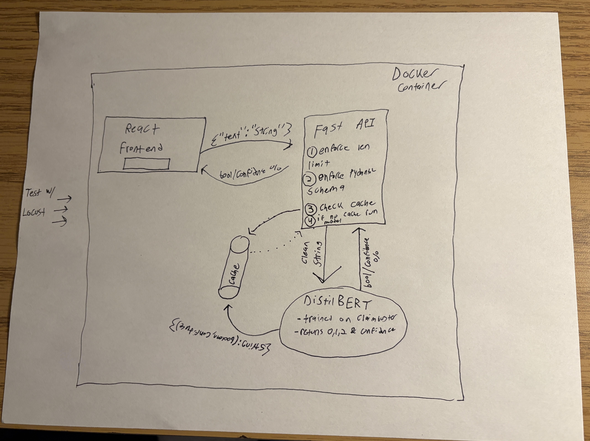

# Project Overview 
This project is a full-stack machine learning application designed to identify whether a given sentence contains a factual claim or assertion. The system classifies natural language input and returns a boolean value along with a confidence score.

## Objectives
- *Fine-tuning*: Train a lightweight encoder model (DistilBERT) for binary classification.
- *API Development*: Build a high-performance FastAPI backend.
- *Production Readiness*: Implement caching, security validation, and Docker containerization.
- *Testing*: Conduct load testing via Locust to simulate production traffic.

# System Architecture 

## Breakdown 
- *Frontend*: A React-based interface allowing users to input text and view classification results (True/False + Confidence %).
- *API Gateway* (FastAPI): Handles incoming POST requests. It includes:
    - _Input Validation_: Pydantic models to enforce data types and string length limits.
    - _LRU Cache_: An in-memory cache to store common phrases, bypassing model inference for repeated queries to save CPU cycles.
- *Inference Engine*: A fine-tuned DistilBERT model. 
- *Deployment*: The entire stack is containerized using Docker for environment parity. 

# Data Modeling and Trainer 
*Datasets: [ClaimBuster](https://zenodo.org/records/3836810) & [FeverClaims](https://fever.ai/dataset/fever.html)*

## Data Proccessing 
In order to ensure that we had a good mix of claims and non-claims along with a breadth of domains 2 datasets were combined. The ClaimBusters dataset was our main dataset but it was weighted towards non-factual statments so the FeverClaims dataset was brought in and proccessed and combined with the Claimbusters to make our final training dataset 
- Mapping: 
    - Label 1: Check-worthy factual statements.
    - Label 0: Non-factual statements.

## Training Workflow 
1. *Preprocessing*: Tokenization via DistilBertTokenizer.
2. *Split*: 80% training / 20% testing.
3. *Metrics*: Focus on F1-Score, Precision, and Recall to ensure the model handles class imbalances effectively.
    ```
    ==============================
    📊 MODEL EVALUATION METRICS 📊
    ==============================
    Accuracy:  0.9424
    F1 Score:  0.9416
    Precision: 0.9542
    Recall:    0.9294
    ==============================
    ```
    
    

# API and Security 
*API: FastAPI* 
- *Endpoint*: ```POST /predict```
    - _Inputs_: ```{"text": "string"}```
    - _Outputs_: ```{"is_claim": boolean, "confidence": float}```
    - _Security_:  
        - Backend Validation: Enforced string length limits to prevent (DoS) via massive text payloads.
        - Type Enforcement: Strict Pydantic schema validation to prevent injection attempts.

# Performance & Testing
*Load testing done via Locust*
- _Goal_: Determine the requests-per-second (RPS) threshold 
- _Result_:

# Contanerization 
The application is wrapped in a multi-stage Docker build:

```
# To build and run
docker build -t claim-detection-api .
docker run -p 8000:8000 claim-detection-api
```


# Setup 
1. Clone the repo: ```git clone https://github.com/Spicerke/Claim_Detection```
2. Install dependencies: ```pip install -r requirements.txt```
3. Run startup script: ```App/start.sh ```
4. Access Swagger Documentation: ```http://localhost:8000/docs```